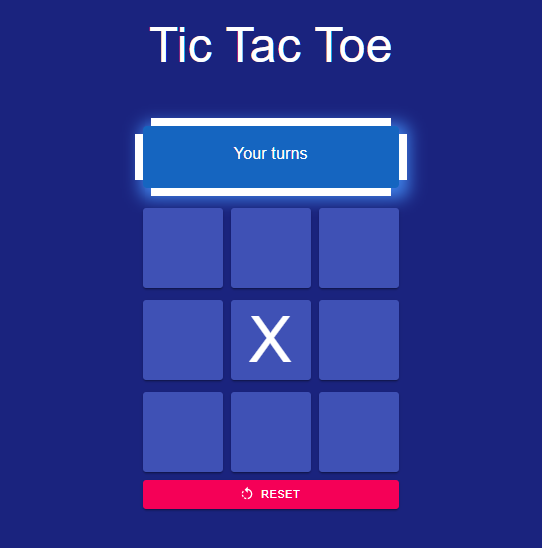

# Tic Tac Toe Game with React App
This is the third project of the Internet engineering course that I have written with React and also this is my first experience in React. I used create-react-app for creating the app

## What is Tic Tac Toe
Tic-tac-toe is a paper-and-pencil game for two players, X and O, who take turns marking the spaces in a 3×3 grid. The player who succeeds in placing three of their marks in a diagonal, horizontal, or vertical row is the winner. It is a solved game with a forced draw assuming best play from both players.
> more info : https://en.wikipedia.org/wiki/Tic-tac-toe

## About my App

The site below helped me a lot:
> Tutorial: Intro to React : https://reactjs.org/tutorial/tutorial.html

for designing, I used material-UI and CSS style for designing my app.
> Material-ui : https://material-ui.com/getting-started/installation/

## Libraries ans Package that I used them
* Node.js
* yarn
* react
* react-dom
* create-react-app
* responsive-css-material-ui
* @material-ui/core
* @material-ui/icons

